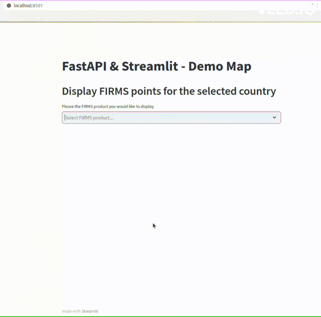

# Streamlit Folium and FastAPI - with FIRMS API

A demo web-map application designed to display active fires for give country based on user selection.



FastAPI was used as backend with a Streamlit Folium map frontend, active fires data are from [FIRMS dataset](https://firms.modaps.eosdis.nasa.gov/) based on country code through the [FIRMS Country API](https://firms.modaps.eosdis.nasa.gov/api/country/). Follow the setup guide below to try it out. Enjoy !!!


## Setup Guide


### 1. Clone the repo

---

**HTTP**

```sh
git clone https://github.com/enguy-hub/streamlit_fastapi_firms.git
```

**SSH**

```sh
git clone git@github.com:enguy-hub/streamlit_fastapi_firms.git
```


### 2. Create and activate Python environment (conda or venv)

---

For `CONDA` environment (assuming conda or miniconda is already installed), run the following command at the root folder:

1. Create a conda environment from the `conda_env.yml` file:

   ```sh
   conda env create --file conda_env.yml
   ```

2. Activate the conda environment:

   ```sh
   conda activate stfapi
   ```

3. Install the packages/dependencies in editable mode:
   ```sh
   pip install -e .
   ```

For `VENV` environment, perform the following commands at the root folder:

1. Create a python `venv` virtual environment:

   ```sh
   python -m venv venv
   ```

2. Activate the virtual environment:

   ```sh
   source venv/bin/activate
   ```

3. Install the package in editable mode:
   ```sh
   pip install -e .
   ```

Source: <https://packaging.python.org/en/latest/guides/installing-using-pip-and-virtual-environments/>


### 3. Run the FastAPI server

---

Run the following command at the root folder:

```sh
uvicorn api.main:app --reload
```

The server will be available at <http://127.0.0.1:8000/>


### 4. Enter FIRMS_MAP_KEY

---

Get your FIRMS Map Key here: <https://firms.modaps.eosdis.nasa.gov/api/area/>

Enter your map key in the `YOUR_FIRMS_MAP_KEY_HERE` variable in the `services/firms_services.py` file


### 5. Run Streamlit app

---

```sh
streamlit run stfapi_firms.py
```

The app will be available at <http://localhost:8501>


# Enjoy the app

---


### Deactivate Python intepreter environment (conda or venv)

---

For `CONDA` environment, run the following command:

```sh
conda deactivate
```

For `VENV` environment, run the following command:

```sh
deactivate
```
